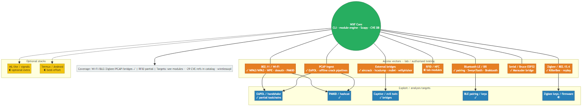
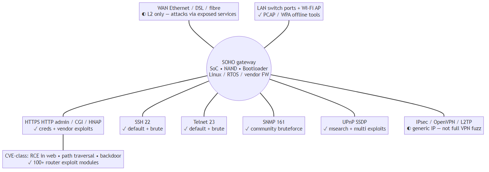
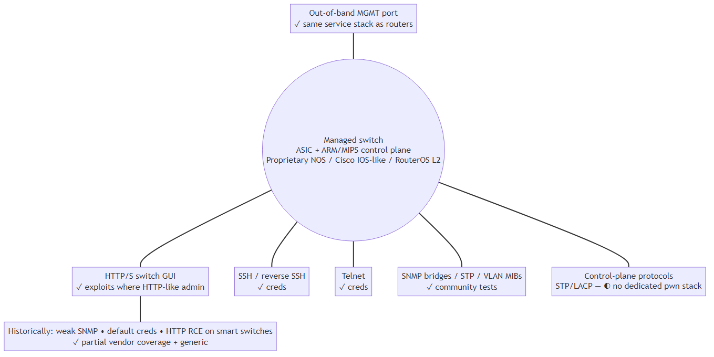
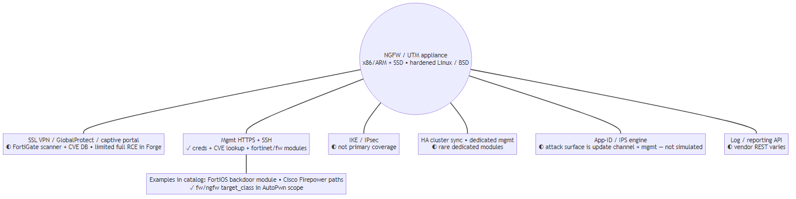
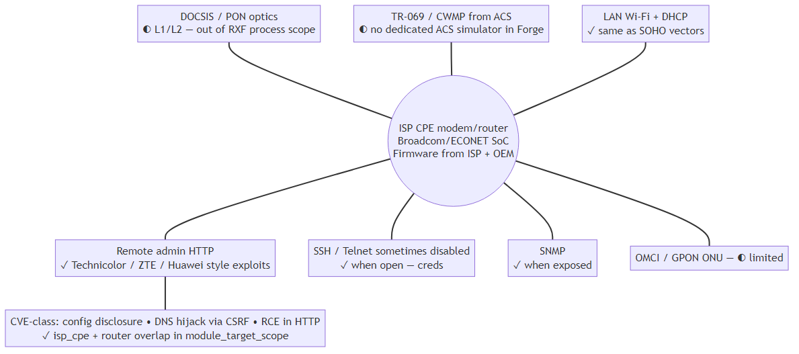
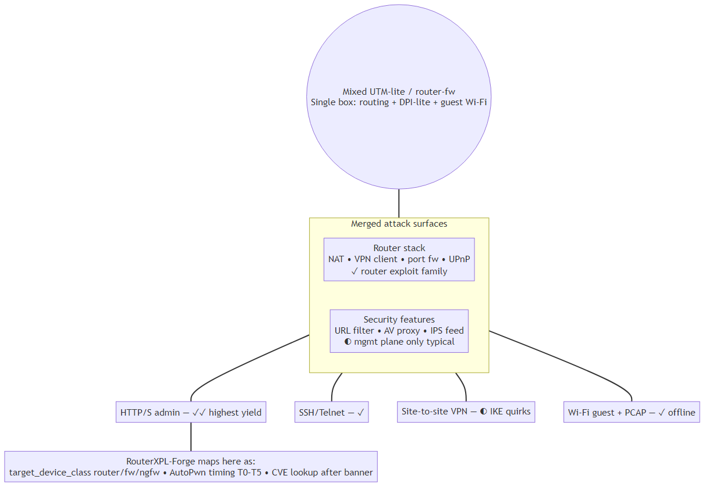
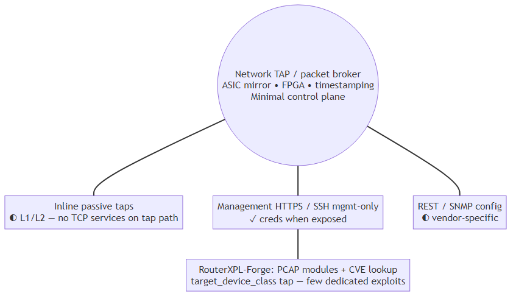

# Documentation folder — `docs/`

**Author:** André Henrique ([@mrhenrike](https://github.com/mrhenrike)) \| **União Geek** — [https://github.com/Uniao-Geek](https://github.com/Uniao-Geek)

**Languages:** Files below are primarily **English (en-US)**. **Português (pt-BR)** hub for this folder: [README.pt-BR.md](README.pt-BR.md). User wiki: [wiki/pt-BR/README.md](wiki/pt-BR/README.md).

## Contents / Conteúdo

| File | Language | Description |
|------|----------|-------------|
| [COVERAGE_MATRIX.md](COVERAGE_MATRIX.md) | en-US | Coverage matrix, external intel tables |
| [FULL_CATALOG.md](FULL_CATALOG.md) | en-US | Full module catalog snapshot |
| [wiki/README.md](wiki/README.md) | bilingual hub | Wiki index (en-US + pt-BR) |
| [diagrams/architecture/README.md](diagrams/architecture/README.md) | en-US + pt-BR | **Attack-surface architecture** (MikrotikAPI-BF style) |
| [img/architecture/](img/architecture/) | en-US labels on PNG | Exported architecture PNGs |
| Intel catalogs | JSON (bilingual summaries) | [wifi6_80211ax_threat_vectors.json](../wirelessxpl/resources/catalogs/wifi6_80211ax_threat_vectors.json) (802.11ax) · [wifi7_80211be_threat_vectors.json](../wirelessxpl/resources/catalogs/wifi7_80211be_threat_vectors.json) (802.11be / MLO) — WPA3-aligned threat vectors for lab |

## Attack-surface architecture (PNGs)

Same visual language as MikrotikAPI-BF hub-and-spoke diagrams. **Mermaid:** [diagrams/architecture/](diagrams/architecture/). **Install** the framework: `pip install wirelessxpl` (see root [README.md](../README.md)). **Gallery:**

| WirelessXPL — full attack surface |
|:---:|
|  |

| SOHO router | Switch |
|:---:|:---:|
|  |  |

| NGFW / UTM | ISP CPE |
|:---:|:---:|
|  |  |

| Mixed edge | Network TAP |
|:---:|:---:|
|  |  |

## Wiki locales

- **English (default):** [wiki/en-US/README.md](wiki/en-US/README.md)
- **Português (Brazil):** [wiki/pt-BR/README.md](wiki/pt-BR/README.md)

## Regeneration hints

```bash
python tools/generate_coverage_matrix.py
python tools/generate_full_catalog.py
python tools/refresh_cve_extended_catalog.py
python tools/gen_wiki_module_index.py
```

---

> **Author:** André Henrique ([@mrhenrike](https://github.com/mrhenrike)) \| **União Geek** — [https://github.com/Uniao-Geek](https://github.com/Uniao-Geek)
